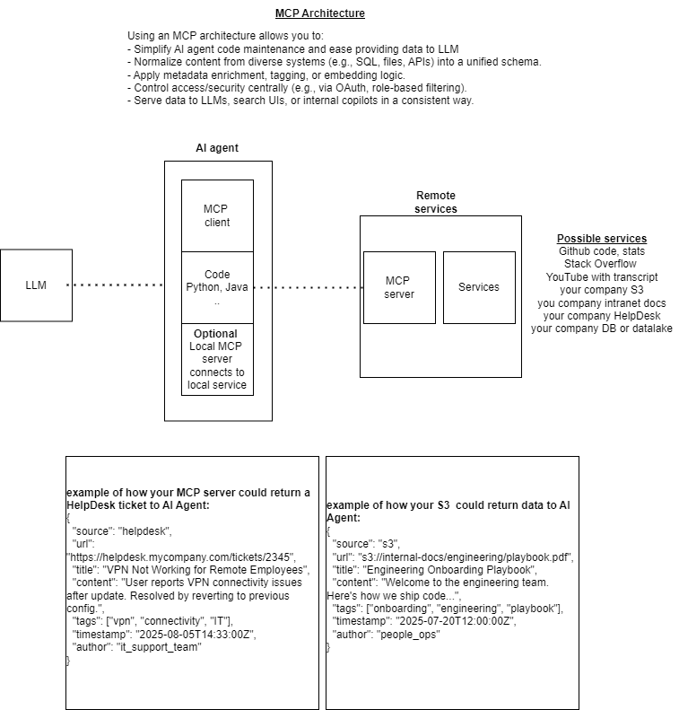

**Caution WIP**

To be able to provide an OSS stack we have chosen Dapr in our golden path (opinionated shortcut) and Dapr has its own MCP path:
 - Please see [Dapr Agents Framework and Roadmap](https://github.com/dapr/dapr-agents/blob/249ea5ec43f75825f662992e765cb09b5fd31695/README.md)
 - [MCP Quickstarts](https://github.com/dapr/dapr-agents/blob/249ea5ec43f75825f662992e765cb09b5fd31695/quickstarts/README.md#mcp-agent-quickstarts)
 - consider [this MCP postgreSQL server example](https://github.com/dapr/dapr-agents/blob/249ea5ec43f75825f662992e765cb09b5fd31695/quickstarts/08-data-agent-mcp-chainlit/README.md)

**Caution WIP**