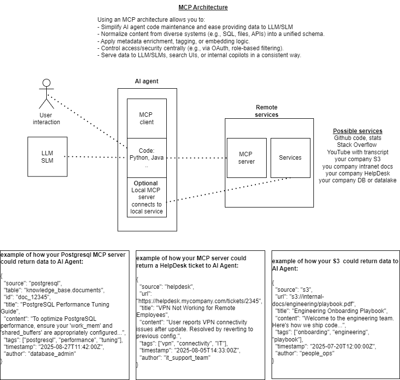

**Caution WIP**

To be able to provide an OSS stack we have chosen Dapr in our golden path (opinionated shortcut) and Dapr has its own MCP path:
 - Please see [Dapr Agents Framework and Roadmap](https://github.com/dapr/dapr-agents/blob/249ea5ec43f75825f662992e765cb09b5fd31695/README.md)
 - [MCP Quickstarts](https://github.com/dapr/dapr-agents/blob/249ea5ec43f75825f662992e765cb09b5fd31695/quickstarts/README.md#mcp-agent-quickstarts)
 - consider [this MCP postgreSQL server example](https://github.com/dapr/dapr-agents/blob/249ea5ec43f75825f662992e765cb09b5fd31695/quickstarts/08-data-agent-mcp-chainlit/README.md) works with OpenAI so you need an API KEY
 - Dapr 1.16 in preview sept 2025 - conversational agent  Ollama support https://v1-16.docs.dapr.io/reference/components-reference/supported-conversation/ollama/




**Caution WIP**
Working in K8S
2025-08-26 16:19:18 - Your app is available at http://localhost:8001
2025-08-26 16:19:26 - Translation file for en not found. Using default translation en-US.
2025-08-26 16:19:26 - Translated markdown file for en not found. Defaulting to chainlit.md.
2025-08-26 16:19:26 - HTTP Request: GET http://127.0.0.1:8000/sse "HTTP/1.1 200 OK"
2025-08-26 16:19:26 - HTTP Request: POST http://127.0.0.1:8000/messages/?session_id=cba0729624fd428f9e4866755be7ace1 "HTTP/1.1 202 Accepted"
2025-08-26 16:19:26 - HTTP Request: POST http://127.0.0.1:8000/messages/?session_id=cba0729624fd428f9e4866755be7ace1 "HTTP/1.1 202 Accepted"
2025-08-26 16:19:26 - HTTP Request: POST http://127.0.0.1:8000/messages/?session_id=cba0729624fd428f9e4866755be7ace1 "HTTP/1.1 202 Accepted"
2025-08-26 16:19:26 - Loaded 9 tools from server 'local'
2025-08-26 16:19:26 - HTTP Request: POST http://127.0.0.1:8000/messages/?session_id=cba0729624fd428f9e4866755be7ace1 "HTTP/1.1 202 Accepted"
2025-08-26 16:19:26 - Loaded 0 prompts from server 'local': 
2025-08-26 16:19:26 - Successfully connected to MCP server 'local' (ephemeral mode)
2025-08-26 16:19:26 - Tool registered: LocalListSchemas
2025-08-26 16:19:26 - Tool registered: LocalListObjects
2025-08-26 16:19:26 - Tool registered: LocalGetObjectDetails
2025-08-26 16:19:26 - Tool registered: LocalExplainQuery
2025-08-26 16:19:26 - Tool registered: LocalAnalyzeWorkloadIndexes
2025-08-26 16:19:26 - Tool registered: LocalAnalyzeQueryIndexes
2025-08-26 16:19:26 - Tool registered: LocalAnalyzeDbHealth
2025-08-26 16:19:26 - Tool registered: LocalGetTopQueries
2025-08-26 16:19:26 - Tool registered: LocalExecuteSql
2025-08-26 16:19:26 - Tool Executor initialized with 9 tool(s).
2025-08-26 16:19:26 - Initializing OpenAI client...
user:
Here is the schema for the tables in the database:

Table _timescaledb_cache.cache_inval_bgw_job:

User's question: what are tthe tables in databse?
Generate the postgres SQL query to answer the user's question. Return only the query string and nothing else.

--------------------------------------------------------------------------------

2025-08-26 16:19:49 - Iteration 1/10 started.
2025-08-26 16:19:49 - Tools are available in the request.
2025-08-26 16:19:49 - Calling OpenAI ChatCompletion...
2025-08-26 16:19:51 - HTTP Request: POST https://api.openai.com/v1/chat/completions "HTTP/1.1 200 OK"
2025-08-26 16:19:51 - ChatCompletion response received.
assistant:
```sql
SELECT table_name FROM information_schema.tables WHERE table_schema = 'public';
```

--------------------------------------------------------------------------------

2025-08-26 16:19:51 - Agent conversation completed after 1 turns.
user:
Execute the following sql query and always return a table format unless instructed otherwise. If the user asks a question regarding the data, return the result and formalize an answer based on inspecting the data: ```sql
SELECT table_name FROM information_schema.tables WHERE table_schema = 'public';
```

--------------------------------------------------------------------------------

2025-08-26 16:19:51 - Iteration 1/10 started.
2025-08-26 16:19:51 - Tools are available in the request.
2025-08-26 16:19:51 - Calling OpenAI ChatCompletion...
2025-08-26 16:19:52 - HTTP Request: POST https://api.openai.com/v1/chat/completions "HTTP/1.1 200 OK"
2025-08-26 16:19:52 - ChatCompletion response received.
assistant:
Function name: LocalExecuteSql (Call Id: call_ZYvx8ZglpIr3OQuqW1zoudgm)
Arguments: {"sql":"SELECT table_name FROM information_schema.tables WHERE table_schema = 'public';"}

--------------------------------------------------------------------------------

2025-08-26 16:19:52 - Running tool (auto): LocalExecuteSql
2025-08-26 16:19:52 - HTTP Request: GET http://127.0.0.1:8000/sse "HTTP/1.1 200 OK"
2025-08-26 16:19:52 - HTTP Request: POST http://127.0.0.1:8000/messages/?session_id=4f3746586bc440dabd9ea3171a78a306 "HTTP/1.1 202 Accepted"
2025-08-26 16:19:52 - HTTP Request: POST http://127.0.0.1:8000/messages/?session_id=4f3746586bc440dabd9ea3171a78a306 "HTTP/1.1 202 Accepted"
2025-08-26 16:19:52 - HTTP Request: POST http://127.0.0.1:8000/messages/?session_id=4f3746586bc440dabd9ea3171a78a306 "HTTP/1.1 202 Accepted"
2025-08-26 16:19:52 - HTTP Request: POST http://127.0.0.1:8000/messages/?session_id=4f3746586bc440dabd9ea3171a78a306 "HTTP/1.1 202 Accepted"
LocalExecuteSql(tool) (Id: call_ZYvx8ZglpIr3OQuqW1zoudgm):
[{'table_name': 'good_answers_embeddings_store'}, {'table_name': 'good_answers_embeddings'}, {'table_name': 'dapr_web_embeddings_store'}, {'table_name': 'dapr_web_embeddings'}, {'table_name': 'document_embeddings_store'}, {'table_name': 'document_embeddings'}, {'table_name': 'dapr_web'}, {'table_name': 'good_answers'}, {'table_name': 'document_metadata'}]

--------------------------------------------------------------------------------

2025-08-26 16:19:52 - Iteration 2/10 started.
2025-08-26 16:19:52 - Tools are available in the request.
2025-08-26 16:19:52 - Calling OpenAI ChatCompletion...
2025-08-26 16:19:54 - HTTP Request: POST https://api.openai.com/v1/chat/completions "HTTP/1.1 200 OK"
2025-08-26 16:19:54 - ChatCompletion response received.
assistant:
| table_name                        |
|-----------------------------------|
| good_answers_embeddings_store     |
| good_answers_embeddings           |
| dapr_web_embeddings_store         |
| dapr_web_embeddings               |
| document_embeddings_store         |
| document_embeddings               |
| dapr_web                          |
| good_answers                      |
| document_metadata                 |

The tables present in the public schema of the database are listed above. If you have any questions about these tables or need further assistance, feel free to ask!

--------------------------------------------------------------------------------

2025-08-26 16:19:54 - Agent conversation completed after 2 turns.
2025-08-26 16:20:08 - Translation file for en not found. Using default translation en-US.
2025-08-26 16:20:17 - Translation file for en not found. Using default translation en-US.
2025-08-26 16:21:09 - Translation file for en not found. Using default translation en-US.


***
2025-08-26 16:30:09 - Created default translation file at /app/.chainlit/translations/zh-TW.json
2025-08-26 16:30:14 - Your app is available at http://localhost:8001
2025-08-26 16:30:57 - Translation file for en not found. Using default translation en-US.
2025-08-26 16:30:57 - Translated markdown file for en not found. Defaulting to chainlit.md.
2025-08-26 16:30:57 - HTTP Request: GET http://127.0.0.1:8000/sse "HTTP/1.1 200 OK"
2025-08-26 16:30:57 - HTTP Request: POST http://127.0.0.1:8000/messages/?session_id=7e60b7778040498290411a1ed864b799 "HTTP/1.1 202 Accepted"
2025-08-26 16:30:57 - HTTP Request: POST http://127.0.0.1:8000/messages/?session_id=7e60b7778040498290411a1ed864b799 "HTTP/1.1 202 Accepted"
2025-08-26 16:30:57 - HTTP Request: POST http://127.0.0.1:8000/messages/?session_id=7e60b7778040498290411a1ed864b799 "HTTP/1.1 202 Accepted"
2025-08-26 16:30:57 - Loaded 9 tools from server 'local'
2025-08-26 16:30:57 - HTTP Request: POST http://127.0.0.1:8000/messages/?session_id=7e60b7778040498290411a1ed864b799 "HTTP/1.1 202 Accepted"
2025-08-26 16:30:57 - Loaded 0 prompts from server 'local': 
2025-08-26 16:30:57 - Successfully connected to MCP server 'local' (ephemeral mode)
2025-08-26 16:30:57 - Tool registered: LocalListSchemas
2025-08-26 16:30:57 - Tool registered: LocalListObjects
2025-08-26 16:30:57 - Tool registered: LocalGetObjectDetails
2025-08-26 16:30:57 - Tool registered: LocalExplainQuery
2025-08-26 16:30:57 - Tool registered: LocalAnalyzeWorkloadIndexes
2025-08-26 16:30:57 - Tool registered: LocalAnalyzeQueryIndexes
2025-08-26 16:30:57 - Tool registered: LocalAnalyzeDbHealth
2025-08-26 16:30:57 - Tool registered: LocalGetTopQueries
2025-08-26 16:30:57 - Tool registered: LocalExecuteSql
2025-08-26 16:30:57 - Tool Executor initialized with 9 tool(s).
2025-08-26 16:30:57 - Initializing OpenAI client...
2025-08-26 16:31:08 - Translation file for en not found. Using default translation en-US.
user:
Here is the schema for the tables in the database:

Table _timescaledb_cache.cache_inval_bgw_job:

User's question: how many rows are in good_answers table?
Generate the postgres SQL query to answer the user's question. Return only the query string and nothing else.

--------------------------------------------------------------------------------

2025-08-26 16:31:31 - Iteration 1/10 started.
2025-08-26 16:31:31 - Tools are available in the request.
2025-08-26 16:31:31 - Calling OpenAI ChatCompletion...
2025-08-26 16:31:32 - HTTP Request: POST https://api.openai.com/v1/chat/completions "HTTP/1.1 200 OK"
2025-08-26 16:31:32 - ChatCompletion response received.
assistant:
Function name: LocalListSchemas (Call Id: call_POJrAUw427uhrGLzFHgrznXe)
Arguments: {}

--------------------------------------------------------------------------------

2025-08-26 16:31:32 - Running tool (auto): LocalListSchemas
2025-08-26 16:31:32 - HTTP Request: GET http://127.0.0.1:8000/sse "HTTP/1.1 200 OK"
2025-08-26 16:31:32 - HTTP Request: POST http://127.0.0.1:8000/messages/?session_id=35a93cc6ad924fecb9ba546aa15798d5 "HTTP/1.1 202 Accepted"
2025-08-26 16:31:32 - HTTP Request: POST http://127.0.0.1:8000/messages/?session_id=35a93cc6ad924fecb9ba546aa15798d5 "HTTP/1.1 202 Accepted"
2025-08-26 16:31:32 - HTTP Request: POST http://127.0.0.1:8000/messages/?session_id=35a93cc6ad924fecb9ba546aa15798d5 "HTTP/1.1 202 Accepted"
2025-08-26 16:31:32 - HTTP Request: POST http://127.0.0.1:8000/messages/?session_id=35a93cc6ad924fecb9ba546aa15798d5 "HTTP/1.1 202 Accepted"
LocalListSchemas(tool) (Id: call_POJrAUw427uhrGLzFHgrznXe):
[{'schema_name': 'information_schema', 'schema_owner': 'postgres', 'schema_type': 'System Information Schema'}, {'schema_name': 'pg_catalog', 'schema_owner': 'postgres', 'schema_type': 'System Schema'}, {'schema_name': 'pg_toast', 'schema_owner': 'postgres', 'schema_type': 'System Schema'}, {'schema_name': '_timescaledb_cache', 'schema_owner': 'postgres', 'schema_type': 'User Schema'}, {'schema_name': '_timescaledb_catalog', 'schema_owner': 'postgres', 'schema_type': 'User Schema'}, {'schema_name': '_timescaledb_config', 'schema_owner': 'postgres', 'schema_type': 'User Schema'}, {'schema_name': '_timescaledb_debug', 'schema_owner': 'postgres', 'schema_type': 'User Schema'}, {'schema_name': '_timescaledb_functions', 'schema_owner': 'postgres', 'schema_type': 'User Schema'}, {'schema_name': '_timescaledb_internal', 'schema_owner': 'postgres', 'schema_type': 'User Schema'}, {'schema_name': 'ai', 'schema_owner': 'postgres', 'schema_type': 'User Schema'}, {'schema_name': 'public', 'schema_owner': 'pg_database_owner', 'schema_type': 'User Schema'}, {'schema_name': 'timescaledb_experimental', 'schema_owner': 'postgres', 'schema_type': 'User Schema'}, {'schema_name': 'timescaledb_information', 'schema_owner': 'postgres', 'schema_type': 'User Schema'}, {'schema_name': 'toolkit_experimental', 'schema_owner': 'postgres', 'schema_type': 'User Schema'}]

--------------------------------------------------------------------------------

2025-08-26 16:31:32 - Iteration 2/10 started.
2025-08-26 16:31:32 - Tools are available in the request.
2025-08-26 16:31:32 - Calling OpenAI ChatCompletion...
2025-08-26 16:31:41 - HTTP Request: POST https://api.openai.com/v1/chat/completions "HTTP/1.1 200 OK"
2025-08-26 16:31:41 - ChatCompletion response received.
assistant:
Function name: LocalListObjects (Call Id: call_67MkSBMxRaCm0milvfA0wwrF)
Arguments: {"schema_name": "_timescaledb_cache", "object_type": "table"}

--------------------------------------------------------------------------------

assistant:
Function name: LocalListObjects (Call Id: call_uImJeFKIW932PpbgrYriETM8)
Arguments: {"schema_name": "_timescaledb_catalog", "object_type": "table"}

--------------------------------------------------------------------------------

assistant:
Function name: LocalListObjects (Call Id: call_WtWSmBr5UeBgRgH86yro5VNE)
Arguments: {"schema_name": "_timescaledb_config", "object_type": "table"}

--------------------------------------------------------------------------------

assistant:
Function name: LocalListObjects (Call Id: call_NBuT9LoMqZDhpLBVYnfR2ncD)
Arguments: {"schema_name": "_timescaledb_debug", "object_type": "table"}

--------------------------------------------------------------------------------

assistant:
Function name: LocalListObjects (Call Id: call_c54faoFgprRyemZq79YKmtS9)
Arguments: {"schema_name": "_timescaledb_functions", "object_type": "table"}

--------------------------------------------------------------------------------

assistant:
Function name: LocalListObjects (Call Id: call_1b39DlwUUqYaCjdeSEAe3Q2l)
Arguments: {"schema_name": "_timescaledb_internal", "object_type": "table"}

--------------------------------------------------------------------------------

assistant:
Function name: LocalListObjects (Call Id: call_Ka91hWHlIvBZdZ1xAM0thctB)
Arguments: {"schema_name": "ai", "object_type": "table"}

--------------------------------------------------------------------------------

assistant:
Function name: LocalListObjects (Call Id: call_dCy3d2XBpzrF4rk0Xe2VfDQa)
Arguments: {"schema_name": "public", "object_type": "table"}

--------------------------------------------------------------------------------

assistant:
Function name: LocalListObjects (Call Id: call_8pS1UsEQGbWXpeXm6sxOfN8b)
Arguments: {"schema_name": "timescaledb_experimental", "object_type": "table"}

--------------------------------------------------------------------------------

assistant:
Function name: LocalListObjects (Call Id: call_OddJNeJZsnGDqKjjPB9xM7gl)
Arguments: {"schema_name": "timescaledb_information", "object_type": "table"}

--------------------------------------------------------------------------------

assistant:
Function name: LocalListObjects (Call Id: call_lbl4hrn18EAgN6keKE8ns611)
Arguments: {"schema_name": "toolkit_experimental", "object_type": "table"}

--------------------------------------------------------------------------------

2025-08-26 16:31:41 - Running tool (auto): LocalListObjects
2025-08-26 16:31:41 - Running tool (auto): LocalListObjects
2025-08-26 16:31:41 - Running tool (auto): LocalListObjects
2025-08-26 16:31:41 - Running tool (auto): LocalListObjects
2025-08-26 16:31:41 - Running tool (auto): LocalListObjects
2025-08-26 16:31:41 - Running tool (auto): LocalListObjects
2025-08-26 16:31:41 - Running tool (auto): LocalListObjects
2025-08-26 16:31:41 - Running tool (auto): LocalListObjects
2025-08-26 16:31:41 - Running tool (auto): LocalListObjects
2025-08-26 16:31:41 - Running tool (auto): LocalListObjects
2025-08-26 16:31:41 - HTTP Request: GET http://127.0.0.1:8000/sse "HTTP/1.1 200 OK"
2025-08-26 16:31:41 - HTTP Request: GET http://127.0.0.1:8000/sse "HTTP/1.1 200 OK"
2025-08-26 16:31:41 - HTTP Request: GET http://127.0.0.1:8000/sse "HTTP/1.1 200 OK"
2025-08-26 16:31:41 - HTTP Request: GET http://127.0.0.1:8000/sse "HTTP/1.1 200 OK"
2025-08-26 16:31:41 - HTTP Request: GET http://127.0.0.1:8000/sse "HTTP/1.1 200 OK"
2025-08-26 16:31:41 - HTTP Request: GET http://127.0.0.1:8000/sse "HTTP/1.1 200 OK"
2025-08-26 16:31:41 - HTTP Request: GET http://127.0.0.1:8000/sse "HTTP/1.1 200 OK"
2025-08-26 16:31:41 - HTTP Request: GET http://127.0.0.1:8000/sse "HTTP/1.1 200 OK"
2025-08-26 16:31:41 - HTTP Request: GET http://127.0.0.1:8000/sse "HTTP/1.1 200 OK"
2025-08-26 16:31:41 - HTTP Request: GET http://127.0.0.1:8000/sse "HTTP/1.1 200 OK"
2025-08-26 16:31:41 - HTTP Request: POST http://127.0.0.1:8000/messages/?session_id=77dabff2418748e280d2351d7a50ba93 "HTTP/1.1 202 Accepted"
2025-08-26 16:31:41 - HTTP Request: POST http://127.0.0.1:8000/messages/?session_id=a8d6b0799db343d89bb12ec25ff53c6b "HTTP/1.1 202 Accepted"
2025-08-26 16:31:41 - HTTP Request: POST http://127.0.0.1:8000/messages/?session_id=e7aea25c5dd3481a84fa5930413f59df "HTTP/1.1 202 Accepted"
2025-08-26 16:31:41 - HTTP Request: POST http://127.0.0.1:8000/messages/?session_id=cb36b0bdc69b498a9d81498ea8abedf4 "HTTP/1.1 202 Accepted"
2025-08-26 16:31:41 - HTTP Request: POST http://127.0.0.1:8000/messages/?session_id=122d8449f2e344c8a0e27c23ef7cb8e1 "HTTP/1.1 202 Accepted"
2025-08-26 16:31:41 - HTTP Request: POST http://127.0.0.1:8000/messages/?session_id=cf94e7220984426491198d41819f79a5 "HTTP/1.1 202 Accepted"
2025-08-26 16:31:41 - HTTP Request: POST http://127.0.0.1:8000/messages/?session_id=bc6f54d6584548d081fef84a94c79669 "HTTP/1.1 202 Accepted"
2025-08-26 16:31:41 - HTTP Request: POST http://127.0.0.1:8000/messages/?session_id=aa485518b8c545bdb41d90957bacba90 "HTTP/1.1 202 Accepted"
2025-08-26 16:31:41 - HTTP Request: POST http://127.0.0.1:8000/messages/?session_id=eb66c756863945778a8763e94acc7924 "HTTP/1.1 202 Accepted"
2025-08-26 16:31:41 - HTTP Request: POST http://127.0.0.1:8000/messages/?session_id=3b81f8687e704bdaa5d67dcccba30745 "HTTP/1.1 202 Accepted"
2025-08-26 16:31:41 - HTTP Request: POST http://127.0.0.1:8000/messages/?session_id=77dabff2418748e280d2351d7a50ba93 "HTTP/1.1 202 Accepted"
2025-08-26 16:31:41 - HTTP Request: POST http://127.0.0.1:8000/messages/?session_id=a8d6b0799db343d89bb12ec25ff53c6b "HTTP/1.1 202 Accepted"
2025-08-26 16:31:41 - HTTP Request: POST http://127.0.0.1:8000/messages/?session_id=e7aea25c5dd3481a84fa5930413f59df "HTTP/1.1 202 Accepted"
2025-08-26 16:31:41 - HTTP Request: POST http://127.0.0.1:8000/messages/?session_id=cb36b0bdc69b498a9d81498ea8abedf4 "HTTP/1.1 202 Accepted"
2025-08-26 16:31:41 - HTTP Request: POST http://127.0.0.1:8000/messages/?session_id=122d8449f2e344c8a0e27c23ef7cb8e1 "HTTP/1.1 202 Accepted"
2025-08-26 16:31:41 - HTTP Request: POST http://127.0.0.1:8000/messages/?session_id=cf94e7220984426491198d41819f79a5 "HTTP/1.1 202 Accepted"
2025-08-26 16:31:41 - HTTP Request: POST http://127.0.0.1:8000/messages/?session_id=bc6f54d6584548d081fef84a94c79669 "HTTP/1.1 202 Accepted"
2025-08-26 16:31:41 - HTTP Request: POST http://127.0.0.1:8000/messages/?session_id=aa485518b8c545bdb41d90957bacba90 "HTTP/1.1 202 Accepted"
2025-08-26 16:31:41 - HTTP Request: POST http://127.0.0.1:8000/messages/?session_id=eb66c756863945778a8763e94acc7924 "HTTP/1.1 202 Accepted"
2025-08-26 16:31:41 - HTTP Request: POST http://127.0.0.1:8000/messages/?session_id=3b81f8687e704bdaa5d67dcccba30745 "HTTP/1.1 202 Accepted"
2025-08-26 16:31:41 - HTTP Request: POST http://127.0.0.1:8000/messages/?session_id=77dabff2418748e280d2351d7a50ba93 "HTTP/1.1 202 Accepted"
2025-08-26 16:31:41 - HTTP Request: POST http://127.0.0.1:8000/messages/?session_id=a8d6b0799db343d89bb12ec25ff53c6b "HTTP/1.1 202 Accepted"
2025-08-26 16:31:41 - HTTP Request: POST http://127.0.0.1:8000/messages/?session_id=e7aea25c5dd3481a84fa5930413f59df "HTTP/1.1 202 Accepted"
2025-08-26 16:31:41 - HTTP Request: POST http://127.0.0.1:8000/messages/?session_id=cb36b0bdc69b498a9d81498ea8abedf4 "HTTP/1.1 202 Accepted"
2025-08-26 16:31:41 - HTTP Request: POST http://127.0.0.1:8000/messages/?session_id=122d8449f2e344c8a0e27c23ef7cb8e1 "HTTP/1.1 202 Accepted"
2025-08-26 16:31:41 - HTTP Request: POST http://127.0.0.1:8000/messages/?session_id=cf94e7220984426491198d41819f79a5 "HTTP/1.1 202 Accepted"
2025-08-26 16:31:41 - HTTP Request: POST http://127.0.0.1:8000/messages/?session_id=bc6f54d6584548d081fef84a94c79669 "HTTP/1.1 202 Accepted"
2025-08-26 16:31:41 - HTTP Request: POST http://127.0.0.1:8000/messages/?session_id=aa485518b8c545bdb41d90957bacba90 "HTTP/1.1 202 Accepted"
2025-08-26 16:31:41 - HTTP Request: POST http://127.0.0.1:8000/messages/?session_id=eb66c756863945778a8763e94acc7924 "HTTP/1.1 202 Accepted"
2025-08-26 16:31:41 - HTTP Request: POST http://127.0.0.1:8000/messages/?session_id=3b81f8687e704bdaa5d67dcccba30745 "HTTP/1.1 202 Accepted"
2025-08-26 16:31:41 - HTTP Request: POST http://127.0.0.1:8000/messages/?session_id=77dabff2418748e280d2351d7a50ba93 "HTTP/1.1 202 Accepted"
2025-08-26 16:31:41 - HTTP Request: POST http://127.0.0.1:8000/messages/?session_id=a8d6b0799db343d89bb12ec25ff53c6b "HTTP/1.1 202 Accepted"
2025-08-26 16:31:41 - HTTP Request: POST http://127.0.0.1:8000/messages/?session_id=e7aea25c5dd3481a84fa5930413f59df "HTTP/1.1 202 Accepted"
LocalListObjects(tool) (Id: call_67MkSBMxRaCm0milvfA0wwrF):
[{'schema': '_timescaledb_cache', 'name': 'cache_inval_bgw_job', 'type': 'BASE TABLE'}, {'schema': '_timescaledb_cache', 'name': 'cache_inval_extension', 'type': 'BASE TABLE'}, {'schema': '_timescaledb_cache', 'name': 'cache_inval_hypertable', 'type': 'BASE TABLE'}]

--------------------------------------------------------------------------------

2025-08-26 16:31:41 - Running tool (auto): LocalListObjects
LocalListObjects(tool) (Id: call_uImJeFKIW932PpbgrYriETM8):
[{'schema': '_timescaledb_catalog', 'name': 'chunk', 'type': 'BASE TABLE'}, {'schema': '_timescaledb_catalog', 'name': 'chunk_column_stats', 'type': 'BASE TABLE'}, {'schema': '_timescaledb_catalog', 'name': 'chunk_constraint', 'type': 'BASE TABLE'}, {'schema': '_timescaledb_catalog', 'name': 'chunk_index', 'type': 'BASE TABLE'}, {'schema': '_timescaledb_catalog', 'name': 'compression_algorithm', 'type': 'BASE TABLE'}, {'schema': '_timescaledb_catalog', 'name': 'compression_chunk_size', 'type': 'BASE TABLE'}, {'schema': '_timescaledb_catalog', 'name': 'compression_settings', 'type': 'BASE TABLE'}, {'schema': '_timescaledb_catalog', 'name': 'continuous_agg', 'type': 'BASE TABLE'}, {'schema': '_timescaledb_catalog', 'name': 'continuous_agg_migrate_plan', 'type': 'BASE TABLE'}, {'schema': '_timescaledb_catalog', 'name': 'continuous_agg_migrate_plan_step', 'type': 'BASE TABLE'}, {'schema': '_timescaledb_catalog', 'name': 'continuous_aggs_bucket_function', 'type': 'BASE TABLE'}, {'schema': '_timescaledb_catalog', 'name': 'continuous_aggs_hypertable_invalidation_log', 'type': 'BASE TABLE'}, {'schema': '_timescaledb_catalog', 'name': 'continuous_aggs_invalidation_threshold', 'type': 'BASE TABLE'}, {'schema': '_timescaledb_catalog', 'name': 'continuous_aggs_materialization_invalidation_log', 'type': 'BASE TABLE'}, {'schema': '_timescaledb_catalog', 'name': 'continuous_aggs_watermark', 'type': 'BASE TABLE'}, {'schema': '_timescaledb_catalog', 'name': 'dimension', 'type': 'BASE TABLE'}, {'schema': '_timescaledb_catalog', 'name': 'dimension_slice', 'type': 'BASE TABLE'}, {'schema': '_timescaledb_catalog', 'name': 'hypertable', 'type': 'BASE TABLE'}, {'schema': '_timescaledb_catalog', 'name': 'metadata', 'type': 'BASE TABLE'}, {'schema': '_timescaledb_catalog', 'name': 'tablespace', 'type': 'BASE TABLE'}, {'schema': '_timescaledb_catalog', 'name': 'telemetry_event', 'type': 'BASE TABLE'}]

--------------------------------------------------------------------------------

LocalListObjects(tool) (Id: call_WtWSmBr5UeBgRgH86yro5VNE):
[{'schema': '_timescaledb_config', 'name': 'bgw_job', 'type': 'BASE TABLE'}]

--------------------------------------------------------------------------------

2025-08-26 16:31:41 - HTTP Request: GET http://127.0.0.1:8000/sse "HTTP/1.1 200 OK"
2025-08-26 16:31:41 - HTTP Request: POST http://127.0.0.1:8000/messages/?session_id=122d8449f2e344c8a0e27c23ef7cb8e1 "HTTP/1.1 202 Accepted"
2025-08-26 16:31:41 - HTTP Request: POST http://127.0.0.1:8000/messages/?session_id=cf94e7220984426491198d41819f79a5 "HTTP/1.1 202 Accepted"
2025-08-26 16:31:41 - HTTP Request: POST http://127.0.0.1:8000/messages/?session_id=bc6f54d6584548d081fef84a94c79669 "HTTP/1.1 202 Accepted"
2025-08-26 16:31:41 - HTTP Request: POST http://127.0.0.1:8000/messages/?session_id=cb36b0bdc69b498a9d81498ea8abedf4 "HTTP/1.1 202 Accepted"
2025-08-26 16:31:41 - HTTP Request: POST http://127.0.0.1:8000/messages/?session_id=3b81f8687e704bdaa5d67dcccba30745 "HTTP/1.1 202 Accepted"
2025-08-26 16:31:41 - HTTP Request: POST http://127.0.0.1:8000/messages/?session_id=eb66c756863945778a8763e94acc7924 "HTTP/1.1 202 Accepted"
2025-08-26 16:31:41 - HTTP Request: POST http://127.0.0.1:8000/messages/?session_id=aa485518b8c545bdb41d90957bacba90 "HTTP/1.1 202 Accepted"
2025-08-26 16:31:41 - HTTP Request: POST http://127.0.0.1:8000/messages/?session_id=f745c2aeff944675be80d513b3d9853b "HTTP/1.1 202 Accepted"
LocalListObjects(tool) (Id: call_Ka91hWHlIvBZdZ1xAM0thctB):
[{'schema': 'ai', 'name': '_vectorizer_errors', 'type': 'BASE TABLE'}, {'schema': 'ai', 'name': '_vectorizer_q_2', 'type': 'BASE TABLE'}, {'schema': 'ai', 'name': '_vectorizer_q_3', 'type': 'BASE TABLE'}, {'schema': 'ai', 'name': '_vectorizer_q_4', 'type': 'BASE TABLE'}, {'schema': 'ai', 'name': '_vectorizer_q_failed_2', 'type': 'BASE TABLE'}, {'schema': 'ai', 'name': '_vectorizer_q_failed_3', 'type': 'BASE TABLE'}, {'schema': 'ai', 'name': '_vectorizer_q_failed_4', 'type': 'BASE TABLE'}, {'schema': 'ai', 'name': 'pgai_lib_feature_flag', 'type': 'BASE TABLE'}, {'schema': 'ai', 'name': 'pgai_lib_migration', 'type': 'BASE TABLE'}, {'schema': 'ai', 'name': 'pgai_lib_version', 'type': 'BASE TABLE'}, {'schema': 'ai', 'name': 'semantic_catalog', 'type': 'BASE TABLE'}, {'schema': 'ai', 'name': 'semantic_catalog_embedding', 'type': 'BASE TABLE'}, {'schema': 'ai', 'name': 'vectorizer', 'type': 'BASE TABLE'}, {'schema': 'ai', 'name': 'vectorizer_worker_process', 'type': 'BASE TABLE'}, {'schema': 'ai', 'name': 'vectorizer_worker_progress', 'type': 'BASE TABLE'}]

--------------------------------------------------------------------------------

LocalListObjects(tool) (Id: call_8pS1UsEQGbWXpeXm6sxOfN8b):
[]

--------------------------------------------------------------------------------

LocalListObjects(tool) (Id: call_OddJNeJZsnGDqKjjPB9xM7gl):
[]

--------------------------------------------------------------------------------

LocalListObjects(tool) (Id: call_NBuT9LoMqZDhpLBVYnfR2ncD):
[]

--------------------------------------------------------------------------------

LocalListObjects(tool) (Id: call_dCy3d2XBpzrF4rk0Xe2VfDQa):
[{'schema': 'public', 'name': 'dapr_web', 'type': 'BASE TABLE'}, {'schema': 'public', 'name': 'dapr_web_embeddings_store', 'type': 'BASE TABLE'}, {'schema': 'public', 'name': 'document_embeddings_store', 'type': 'BASE TABLE'}, {'schema': 'public', 'name': 'document_metadata', 'type': 'BASE TABLE'}, {'schema': 'public', 'name': 'good_answers', 'type': 'BASE TABLE'}, {'schema': 'public', 'name': 'good_answers_embeddings_store', 'type': 'BASE TABLE'}]

--------------------------------------------------------------------------------

LocalListObjects(tool) (Id: call_1b39DlwUUqYaCjdeSEAe3Q2l):
[{'schema': '_timescaledb_internal', 'name': 'bgw_job_stat', 'type': 'BASE TABLE'}, {'schema': '_timescaledb_internal', 'name': 'bgw_job_stat_history', 'type': 'BASE TABLE'}, {'schema': '_timescaledb_internal', 'name': 'bgw_policy_chunk_stats', 'type': 'BASE TABLE'}]

--------------------------------------------------------------------------------

LocalListObjects(tool) (Id: call_c54faoFgprRyemZq79YKmtS9):
[]

--------------------------------------------------------------------------------

2025-08-26 16:31:41 - HTTP Request: POST http://127.0.0.1:8000/messages/?session_id=f745c2aeff944675be80d513b3d9853b "HTTP/1.1 202 Accepted"
2025-08-26 16:31:41 - HTTP Request: POST http://127.0.0.1:8000/messages/?session_id=f745c2aeff944675be80d513b3d9853b "HTTP/1.1 202 Accepted"
2025-08-26 16:31:41 - HTTP Request: POST http://127.0.0.1:8000/messages/?session_id=f745c2aeff944675be80d513b3d9853b "HTTP/1.1 202 Accepted"
LocalListObjects(tool) (Id: call_lbl4hrn18EAgN6keKE8ns611):
[]

--------------------------------------------------------------------------------

2025-08-26 16:31:41 - Iteration 3/10 started.
2025-08-26 16:31:41 - Tools are available in the request.
2025-08-26 16:31:41 - Calling OpenAI ChatCompletion...
2025-08-26 16:31:43 - HTTP Request: POST https://api.openai.com/v1/chat/completions "HTTP/1.1 200 OK"
2025-08-26 16:31:43 - ChatCompletion response received.
assistant:
```sql
SELECT COUNT(*) FROM public.good_answers;
```

--------------------------------------------------------------------------------

2025-08-26 16:31:43 - Agent conversation completed after 3 turns.
user:
Execute the following sql query and always return a table format unless instructed otherwise. If the user asks a question regarding the data, return the result and formalize an answer based on inspecting the data: ```sql
SELECT COUNT(*) FROM public.good_answers;
```

--------------------------------------------------------------------------------

2025-08-26 16:31:43 - Iteration 1/10 started.
2025-08-26 16:31:43 - Tools are available in the request.
2025-08-26 16:31:43 - Calling OpenAI ChatCompletion...
2025-08-26 16:31:44 - HTTP Request: POST https://api.openai.com/v1/chat/completions "HTTP/1.1 200 OK"
2025-08-26 16:31:44 - ChatCompletion response received.
assistant:
Function name: LocalExecuteSql (Call Id: call_8ohwxXgbOY5NSm22gYSTRduC)
Arguments: {"sql":"SELECT COUNT(*) FROM public.good_answers;"}

--------------------------------------------------------------------------------

2025-08-26 16:31:44 - Running tool (auto): LocalExecuteSql
2025-08-26 16:31:44 - HTTP Request: GET http://127.0.0.1:8000/sse "HTTP/1.1 200 OK"
2025-08-26 16:31:44 - HTTP Request: POST http://127.0.0.1:8000/messages/?session_id=d0187fb2fde44dea9fff97f14b60f782 "HTTP/1.1 202 Accepted"
2025-08-26 16:31:44 - HTTP Request: POST http://127.0.0.1:8000/messages/?session_id=d0187fb2fde44dea9fff97f14b60f782 "HTTP/1.1 202 Accepted"
2025-08-26 16:31:44 - HTTP Request: POST http://127.0.0.1:8000/messages/?session_id=d0187fb2fde44dea9fff97f14b60f782 "HTTP/1.1 202 Accepted"
2025-08-26 16:31:44 - HTTP Request: POST http://127.0.0.1:8000/messages/?session_id=d0187fb2fde44dea9fff97f14b60f782 "HTTP/1.1 202 Accepted"
LocalExecuteSql(tool) (Id: call_8ohwxXgbOY5NSm22gYSTRduC):
[{'count': 7}]

--------------------------------------------------------------------------------

2025-08-26 16:31:44 - Iteration 2/10 started.
2025-08-26 16:31:44 - Tools are available in the request.
2025-08-26 16:31:44 - Calling OpenAI ChatCompletion...
2025-08-26 16:31:46 - HTTP Request: POST https://api.openai.com/v1/chat/completions "HTTP/1.1 200 OK"
2025-08-26 16:31:46 - ChatCompletion response received.
assistant:
| count |
|-------|
|   7   |

The `good_answers` table contains 7 rows.

--------------------------------------------------------------------------------

2025-08-26 16:31:46 - Agent conversation completed after 2 turns.
2025-08-26 16:32:09 - Translation file for en not found. Using default translation en-US.
2025-08-26 16:32:40 - Translation file for en not found. Using default translation en-US.