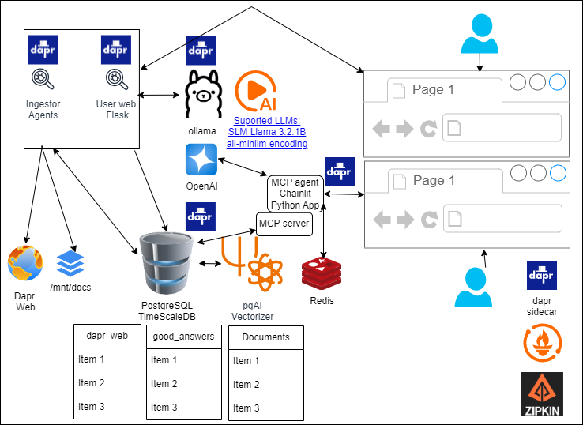

# 1- Monitoring tools:

## 1.1 - Zipkin:
- Zipkin allows us to follow traces between microservices calls graphically.
- Zipkin is installed by default with dapr enin dev environment.
- We need to create a zipkin configuration for each namespace services we want to monitor.
- How to install it, check step 4.1.a) in
    - 1-IaC/AWS/opentofu/userdata.sh
    - 1-IaC/WSL2/install-in-WSL2.sh
- Port forward: k -n default port-forward service/dapr-dev-zipkin 9411:9411 
- Access in http://localhost:9411 

- Links:
  - [Dapr tracing overview](https://docs.dapr.io/operations/observability/tracing/tracing-overview/)
  - [Dapr tracing zipkin](https://docs.dapr.io/operations/observability/tracing/zipkin/)

## 1.2 - Prometheus:
- Prometheus is an open-source monitoring and alerting toolkit designed for reliability and scalability massively used in K8S.
- How to install it, check step 4.1.b in
    - 1-IaC/AWS/opentofu/userdata.sh
    - 1-IaC/WSL2/install-in-WSL2.sh
- Port forward: k port-forward svc/dapr-prom-prometheus-server 9090:80 -n dapr-monitoring &
- Access in http://localhost:9090
- Link [Dapr observability with Prometheus](https://docs.dapr.io/operations/observability/metrics/prometheus/)

## 1.3 - Grafana
- Although basic parameter monitoring can be done with Prometheus, Grafana provides beautiful and very comprenhensible charts.
- How to install it, check step 4.1.c in
    - 1-IaC/AWS/opentofu/userdata.sh
    - 1-IaC/WSL2/install-in-WSL2.sh
- How to manually configure datasource and charts, see [link](https://docs.dapr.io/operations/observability/metrics/grafana/#configure-prometheus-as-data-source)
- Port forward  k port-forward svc/dapr-prom-alertmanager 8080:80 -n dapr-monitoring &
- Access in http://localhost:8080
- Links:
    - [Dapr with Grafana](https://docs.dapr.io/operations/observability/metrics/grafana/)
    - [K8S dashboards](https://github.com/dotdc/grafana-dashboards-kubernetes)
   

# 2 - Probable next steps: **WIP*
**Jupyter notebook**
- Direct Access to Your RAG DB: you can connect from notebooks directly to your pgvector/pgai database inside the same cluster.
- One Place for Code + Experiments: you can iterate on chunking strategies, embeddings, prompt engineering, and query pipelines all in one interactive environment.
- Reproducibility: notebooks can serve as “AI experiment logs” where each cell documents exactly what you tried.
- Leverage K8s Resources: you can give the Jupyter Pod more CPU/RAM or even GPU if you add one to your node.
- See [link] (https://cloudyuga.guru/blogs/empowering-data-science-running-jupyter-notebooks-at-scale-with-kubernetes/)

**MLflow**: requires less memory than Kubeflow and it is better for exploratory experiments in ML area. See [link](https://mlflow.org/docs/latest/ml/deployment/deploy-model-to-kubernetes/tutorial/)

**GitOps ArgoCD?**
When we have more AI agents may be ...
